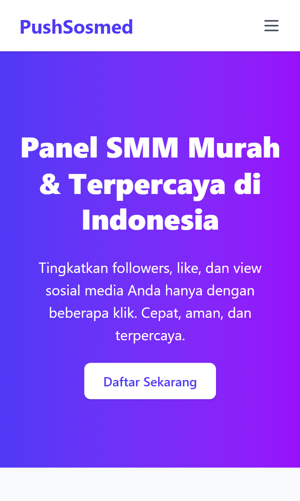
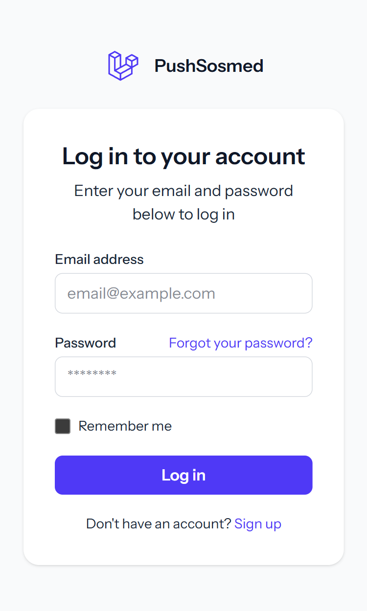

# PushSosmed Panel SMM Using Laravel 12

Sebuah aplikasi web berbasis Laravel untuk **meningkatkan engagement sosial media**.

---

## Fitur
- [x] Autentikasi user (register, login, logout)
- [x] Role based (user, admin)
- [x] Dashboard User
- [ ] Dashboard Admin (coming soon)
- [ ] API integration (coming soon)
- [x] Live validation dengan Livewire
- [x] Tailwind CSS for styling
- [ ] Email validation (coming soon)
- [x] Landing page

---

## Screenshoot

  
  

  

